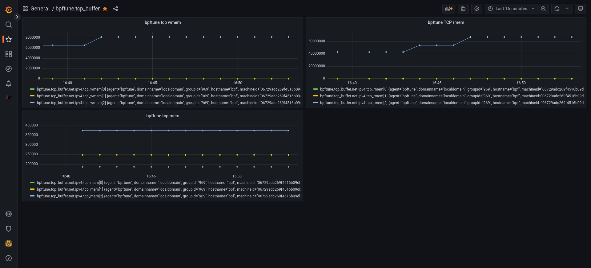

# bpftune - BPF driven auto-tuning

bpftune aims to provide lightweight, always-on auto-tuning of system
behaviour.  The key benefit it provides are

- by using BPF observability features, we can continuously monitor
  and adjust system behaviour
- because we can observe system behaviour at a fine grain (rather
  than using coarse system-wide stats), we can tune at a finer grain
  too (individual socket policies, individual device policies etc)

## The problem

The Linux kernel contains a large number of tunables; these
often take the form of sysctl(8) parameters, and are usually
introduced for situations where there is no one "right" answer
for a configuration choice.  The number of tunables available
is quite daunting.  On a 6.2 kernel we see

```
# sysctl --all 2>/dev/null|wc -l
1624
```

[See here for an excellent writeup on network-related tunables.](https://github.com/leandromoreira/linux-network-performance-parameters).

At the same time, individual systems get a lot less care
and adminstrator attention than they used to; phrases like
"cattle not pets" exemplify this.  Given the modern cloud
architectures used for most deployments, most systems never
have any human adminstrator interaction after initial
provisioning; in fact given the scale requirements, this
is often an explicit design goal - "no ssh'ing in!".

These two observations are not unrelated; in an earlier
era of fewer, larger systems, tuning by administrators was
more feasible.

These trends - system complexity combined with minimal
admin interaction suggest a rethink in terms of tunable
management.

A lot of lore accumulates around these tunables, and to help
clarify why we developed bpftune, we will use a straw-man
version of the approach taken with tunables:

"find the set of magic numbers that will work for the
 system forever"

This is obviously a caricature of how administrators
approach the problem, but it does highlight a critical
implicit assumption - that systems are static.

And that gets to the "BPF" in bpftune; BPF provides means
to carry out low-overhead observability of systems. So
not only can we observe the system and tune appropriately,
we can also observe the effect of that tuning and re-tune
if necessary.

## Key design principles

- Minimize overhead.  Use observability features sparingly; do not
  trace very high frequency events.
- Be explicit about policy changes providing both a "what" - what
  change was made - and a "why" - how does it help? syslog logging
  makes policy actions explicit with explanations
- Get out of the way of the administrator.  We can use BPF
  observability to see if the admin sets tunable values that we
  are auto-tuning; if they do, we need to get out of the way and
  disable auto-tuning of the related feature set.
- Don't replace tunables with more tunables! bpftune is designed to
  be zero configuration; there are no options, and we try to avoid
  magic numbers where possible.
- Use push-pull approaches. For example, with tcp buffer sizing,
  we often want to get out of the way of applications and bump
  up tcp sndbuf and rcvbuf, but at a certain point we run the
  risk of exhausting TCP memory.  We can however monitor if we
  are approaching TCP memory pressure and if so we can tune down
  values that we've tuned up.  In this way, we can let the system
  find a balance between providing resources and exhausting them.
  In some cases, we won't need to tune up values; they may be fine
  as they are. But in other cases these limits block optimal performance,
  and if they are raised safely - with awareness of global memory
  limits - we can get out the way of improved performance.  Another
  concern is that increasing buffer size leads to latency - to
  handle that, we correlate buffer size changes and TCP smoothed
  round-trip time; if the correlation between these exceeds a
  threshold (0.7) we stop increasing buffer size.

## Concepts

The key components are

- tuners: each tuner manages tunables and handles events sent
  from BPF programs to userspace via the shared ring buffer.
  Each tuner has an associated set of tunables that it manages.

- optional strategies: a tuner can specify multiple strategies;
  after running for a while a strategy times out and we assess
  if a better strategy is available.  Each strategy specifies a
	- name
	- description
	- timeout	
	- evaluation function
	- set of BPF program names in tuner associated with strategy

  Strategies are optional and should be set in the tuner init()
  method via bpftune_strategies_add().  See test/strategy
  for a coded example.  When a strategy times out, the various
  evaluation functions are called and the highest-value evaluation
  dictates the next stratgey.

  Strategies provide a way of providing multiple schemes for
  auto-tuning the same set of tunables, where the choice is
  guided by an evaluation of the effectiveness of the strategies.

- events specify a
	- tuner id: which tuner the event is destined for
	- a scenario: what happened
	- an associated netns (if supported)
	- information about the event (IP address etc)

- the tuner then responds to the event guided by the active strategy;
  increase or decrease a tunable value, etc.  Describing the event
  in the log is key; this allows an admin to understand what
  changed and why.

## Architecture

- bpftune is a daemon which manages a set of .so plugin tuners;
  each of these is a shared object that is loaded on start-up.
- tuners can be enabled or disabled; a tuner is automatically
  disabled if the admin changes associated tunables manually.
- tuners share a global BPF ring buffer which allows posting of
  events from BPF programs to userspace.  For example, if the
  sysctl tuner sees a systl being set, it posts an event.
- each tuner has an associated id (set when it is loaded),
  and events posted contain the tuner id.
- each tuner has a BPF component (built using a BPF skeleton)
  and a userspace component.  The latter has init(), fini()
  and event_handler() entrypoints.  When an event is
  received, the tuner id is used to identify the appropriate
  event handler and its event_handler() callback function is run.
- init, fini and event_handler functions are loaded from the
  tuner .so object.
- BPF components should include bpftune.bpf.h; it contains
  the common map definitions (ringbuf, etc) and shared variables
  such as learning rate and tuner ids that each tuner needs.

## Supported tuners

- TCP connection tuner: auto-tune choice of congestion control algorithm.
  See [bpftune-tcp-conn (8)](./docs/bpftune-tcp-conn.rst)
- IP fragmentation tuner: auto-tune IP fragmentation memory limits
  to support fragment reassembly.  See [bpftune-ip-frag (8)](./docs/bpftune-ip-frag.rst)
- neighbour table tuner: auto-tune neighbour table sizes by growing
  tables when approaching full. See [bpftune-neigh (8)](./docs/bpftune-neigh.rst)
- sysctl tuner: monitor sysctl setting and if it collides with an
  auto-tuned sysctl value, disable the associated tuner.  See
  [bpftune-sysctl (8)](./docs/bpftune-sysctl.rst)
- TCP buffer tuner: auto-tune max and initial buffer sizes.  See
  [bpftune-tcp-buffer (8)](./docs/bpftune-tcp-buffer.rst)
- net buffer tuner: auto-tune tunables related to core networking.
  See [bpftune-net-buffer (8)](./docs/bpftune-net-buffer.rst)
- netns tuner: notices addition and removal of network namespaces,
  which helps power namespace awareness for bpftune as a whole.
  Namespace awareness is important as we want to be able to auto-tune
  containers also.  See [bpftune-netns (8)](./docs/bpftune-netns.rst)
- UDP buffer tuner: auto-tune buffers relating to UDP. See
  [bpftune-udp-buffer (8)](./docs/bpftune-udp-buffer.rst)
- Gaming tuner: detects sustained low-latency UDP activity and applies
  per-profile network tweaks for gaming workloads.

## Code organization

Both core bpftune.c and individual tuners use the libbpftune library.
It handles logging, tuner init/fini, and BPF init/fini.

Each tuner shared object defines an init(), fini() and event_handler()
function. These respectively set up and clean up BPF and handle events
that originate from the BPF code.

## Getting Started

If building the repository manually, simply run

```
$ make ; sudo make install
```
at the top-level of the repository.  bpftune also supports a

```
$ make pkg
```

target, which will make a bpftune RPM.  See ./buildrpm/bpftune.spec

We can also build with non-standard libdir for distros which do not
use /usr/lib64 like CachyOS; in this case to install to /usr/lib
instead

```
$ make libdir=lib
$ sudo make install libdir=lib
```

To build the following packages are needed (names may vary by distro);

- libbpf, libbpf-devel >= 0.6
- libcap-devel
- bpftool >= 4.18
- libnl3-devel (on some distros like Debian libnl-route-3-dev is needed)
- clang >= 11
- llvm >= 11
- python3-docutils

The bpf components in bpftune can be built via GCC BPF support.
See https://gcc.gnu.org/wiki/BPFBackEnd for details on the BPF backend.
To build with gcc bpf, specify

```
$ GCC_BPF=bpf-unknown-none-gcc make
```

From the kernel side, the kernel needs to support BPF ring buffer
(around the 5.6 kernel, though 5.4 is supported on Oracle Linux
as ring buffer support was backported), and kernel BTF is
required (CONFIG_DEBUG_INFO_BTF=y).  Verify /sys/kernel/btf/vmlinux
is present.

To enable bpftune as a service

```
$ sudo service bpftune start
```

...and to enable it by default

```
$ sudo systemctl enable bpftune
```

bpftune logs to syslog so /var/log/messages will contain details
of any tuning carried out.

bpftune can also be run in the foreground as a program; to redirect
output to stdout/stderr, run

```
$ sudo bpftune -s
```

On exit, bpftune will summarize any tuning done.

Queries of bpftune state can be done via `bpftune -q`.

## Performance Co-Pilot (PCP) Support

Support has been added to export bpftune tunable values to Performance
Co-Pilot via a PMDA (Performance Metric Domain Agent).  It uses
bpftune quereies to populate metrics in PCP via a python-based
PMDA.  See src/pcp/pmdabpftune.python.

To install the PMDA (ensuring pcp and python3-pcp packages are installed
first), simply run

```
$ sudo make install
$ cd /var/lib/pcp/pmdas/bpftune
$ sudo ./Install

```

Once the above has been done, PCP metrics will be available for bpftune
tunables.  To see these:

```
$ pminfo -f bpftune

bpftune.udp_buffer.net.core.rmem_default
    value 212992

bpftune.udp_buffer.net.core.rmem_max
    value 3099438
...
```

The PMDA is also packaged in bpftune-pcp-pmda; see buildrpm/bpftune.spec.

To create grafana dashboards using bpftune tunables, see the
[blog entry here](https://blogs.oracle.com/linux/post/visualising-pcp-metrics-using-grafana)
for details on setting up grafana to handle PCP metric visualization.

From there it is necessary to ensure that pmlogger is logging the metrics
regularly; add something like the following to

/var/lib/pcp/config/pmlogger/config.default

```
log advisory on default {
        bpftune.tcp_buffer.net.ipv4.tcp_rmem
        bpftune.tcp_buffer.net.ipv4.tcp_wmem
        bpftune.tcp_buffer.net.ipv4.tcp_mem
}
```

...and restart pmlogger

```
$ sudo service pmlogger restart
```

Once that is done, it should be possible to create dashboards with
queries of bpftune metrics.  For example here is a simple dashboard
created for the tcp_buffer tuner:



## Ansible Install Play

Information: If you are using an Fedora Upstream based Distribution you have to enable the correct repository based on the system you are using, because the libbpf-devel package is getting shipped on additional repository, based on the Distribution. You can look it up here: https://pkgs.org/search/?q=libbpf-devel

```
- name: bpftune download, build, install and start service
  hosts: all
  become: true
  vars:
    repo_url: "https://github.com/oracle/bpftune"
    repo_dest: "/root/bpftune/"
  tasks:
    - name: Install git and system independent build requirements if not present
      ansible.builtin.package:
        name:
          - git
          - clang            # build requirement
          - llvm             # build requirement
          - bpftool          # build requirement
          - iperf3           # build requirement
          - python3-docutils # build requirement
        state: present

    - name: Gather package manager fact
      ansible.builtin.setup:
        filter: ansible_pkg_mgr
      register: setup_info

    - name: install run and build requirements for bpftune on dnf based systems
      ansible.builtin.dnf:
        name:
          - libbpf       # run requirement
          - libnl3       # run requirement
          - libcap       # run requirement
          - libbpf-devel # build requirement
          - libnl3-devel # build requirement
          - libcap-devel # build requirement
          - clang-libs   # build requirement
          - llvm-libs    # build requirement
        state: present
        # enablerepo: <repository> # !ATTENTION! based on the system you use you have to enable the correct repository based on the system you can look it up here: https://pkgs.org/search/?q=libbpf-devel
      when: setup_info.ansible_facts.ansible_pkg_mgr == "dnf"

    - name: install build requirements for bpftune on apt based systems
      ansible.builtin.apt:
        name:
          - libbpf-dev        # build requirement
          - libcap-dev        # build requirement
          - libnl-3-dev       # build requirement
          - libnl-route-3-dev # build requirement
        state: present
        install_recommends: false
      when: setup_info.ansible_facts.ansible_pkg_mgr == "apt"

    - name: Clone or update the bpftune repository if a new version is available
      ansible.builtin.git:
        repo: "{{ repo_url }}"
        dest: "{{ repo_dest }}"
        update: true
      register: git_result

    - name: if repository changes rebuild software
      block:
        - name: Run make with taget 'all' for bpftune
          community.general.make:
            chdir: "{{ repo_dest }}"
            target: all

        - name: Run make with taget 'install' target for bpftune
          community.general.make:
            chdir: "{{ repo_dest }}"
            target: install

        - name: Check bpftune status
          command: bpftune -S
          register: bpftune_status
          changed_when: false
          failed_when: "'bpftune works fully' not in bpftune_status.stderr"

        - name: restart and enable bpftune service
          ansible.builtin.service:
            name: bpftune.service
            state: started
            enabled: yes
      when: git_result.changed
```

## Tests

Tests are supplied for each tuner in the tests/ subdirectory.
"make test" runs all the tests.  Tests use network namespaces
to simulate interactions with remote hosts. See ./TESTING.md
for more details.

## Does my system support bpftune?

Simply run "bpftune -S" to see:

```
$ bpftune -S
bpftune works fully
bpftune supports per-netns policy (via netns cookie)
```

Two aspects are important here

- does the system support fentry/fexit etc? If so full support
  is likely.
- does the system support network namespace cookies? If so
  per-network-namespace policy is supported.

## Demo

Simply starting bpftune and observing changes made via /var/log/messages
can be instructive.  For example, on a standard VM with sysctl defaults,
I ran

```
$ service bpftune start
```

...and went about normal development activities such as cloning git
trees from upstream, building kernels, etc.  From the log we see
some of the adjustments bpftune made to accommodate these activities

```
$ sudo grep bpftune /var/log/messages
...
Apr 19 16:14:59 bpftest bpftune[2778]: bpftune works fully
Apr 19 16:14:59 bpftest bpftune[2778]: bpftune supports per-netns policy (via netns cookie)
Apr 19 16:18:40 bpftest bpftune[2778]: Scenario 'specify bbr congestion control' occurred for tunable 'TCP congestion control' in global ns. Because loss rate has exceeded 1 percent for a connection, use bbr congestion control algorithm instead of default
Apr 19 16:18:40 bpftest bpftune[2778]: due to loss events for 145.40.68.75, specify 'bbr' congestion control algorithm
Apr 19 16:26:53 bpftest bpftune[2778]: Scenario 'need to increase TCP buffer size(s)' occurred for tunable 'net.ipv4.tcp_rmem' in global ns. Need to increase buffer size(s) to maximize throughput
Apr 19 16:26:53 bpftest bpftune[2778]: Due to need to increase max buffer size to maximize throughput change net.ipv4.tcp_rmem(min default max) from (4096 131072 6291456) -> (4096 131072 7864320)
Apr 19 16:26:53 bpftest bpftune[2778]: Scenario 'need to increase TCP buffer size(s)' occurred for tunable 'net.ipv4.tcp_rmem' in global ns. Need to increase buffer size(s) to maximize throughput
Apr 19 16:26:53 bpftest bpftune[2778]: Due to need to increase max buffer size to maximize throughput change net.ipv4.tcp_rmem(min default max) from (4096 131072 7864320) -> (4096 131072 9830400)
Apr 19 16:29:04 bpftest bpftune[2778]: Scenario 'specify bbr congestion control' occurred for tunable 'TCP congestion control' in global ns. Because loss rate has exceeded 1 percent for a connection, use bbr congestion control algorithm instead of default
Apr 19 16:29:04 bpftest bpftune[2778]: due to loss events for 140.91.12.81, specify 'bbr' congestion control algorithm
```

To deterministically trigger bpftune behaviour, one approach we can
take is to download a large file with inappropriate settings.

In one window, set tcp rmem max to a too-low value, and run bpftune
as a program logging to stdout/stderr (-s):

```
$ sudo sysctl -w net.ipv4.tcp_rmem="4096 131072 1310720"
net.ipv4.tcp_rmem = 4096 131072 1310720
$ sudo bpftune -s
```

In another window, wget a large file:

```
$ wget https://yum.oracle.com/ISOS/OracleLinux/OL8/u7/x86_64/OracleLinux-R8-U7-x86_64-dvd.iso
```

In the first window, we see bpftune tuning up rmem:

```
bpftune: bpftune works in legacy mode
bpftune: bpftune does not support per-netns policy (via netns cookie)
bpftune: Scenario 'need to increase TCP buffer size(s)' occurred for tunable 'net.ipv4.tcp_rmem' in global ns. Need to increase buffer size(s) to maximize throughput
bpftune: Due to need to increase max buffer size to maximize throughput change net.ipv4.tcp_rmem(min default max) from (4096 131072 1310720) -> (4096 131072 1638400)
```

This occurs multiple times, and on exit (Ctrl+C) we see
the summary of changes made:

```
bpftune: Summary: scenario 'need to increase TCP buffer size(s)' occurred 9 times for tunable 'net.ipv4.tcp_rmem' in global ns. Need to increase buffer size(s) to maximize throughput
bpftune: sysctl 'net.ipv4.tcp_rmem' changed from (4096 131072 1310720 ) -> (4096 131072 9765625 )
```

## For more info

See the docs/ subdirectory for manual pages covering bpftune
and associated tuners.

bpftune was presented at the eBPF summit; [video here](https://www.youtube.com/watch?v=X0TvfH8hrQE&t=420s).

bpftune [was also discussed on Liz Rice's excellent eCHO eBPF podcast](https://www.youtube.com/watch?v=3ylmGE6sW8w), specifically in the context of using reinforcement learning in BPF 
## Contributing

This project welcomes contributions from the community. Before submitting a pull request, please [review our contribution guide](./CONTRIBUTING.md)

## Security

Please consult the [security guide](./SECURITY.md) for our responsible security vulnerability disclosure process

## License

Copyright (c) 2023 Oracle and/or its affiliates.

This software is available to you under

SPDX-License-Identifier: GPL-2.0 WITH Linux-syscall-note

Being under the terms of the GNU General Public License version 2.

SPDX-URL: https://spdx.org/licenses/GPL-2.0.html

See [the license file](./LICENSE.txt) for more details.
